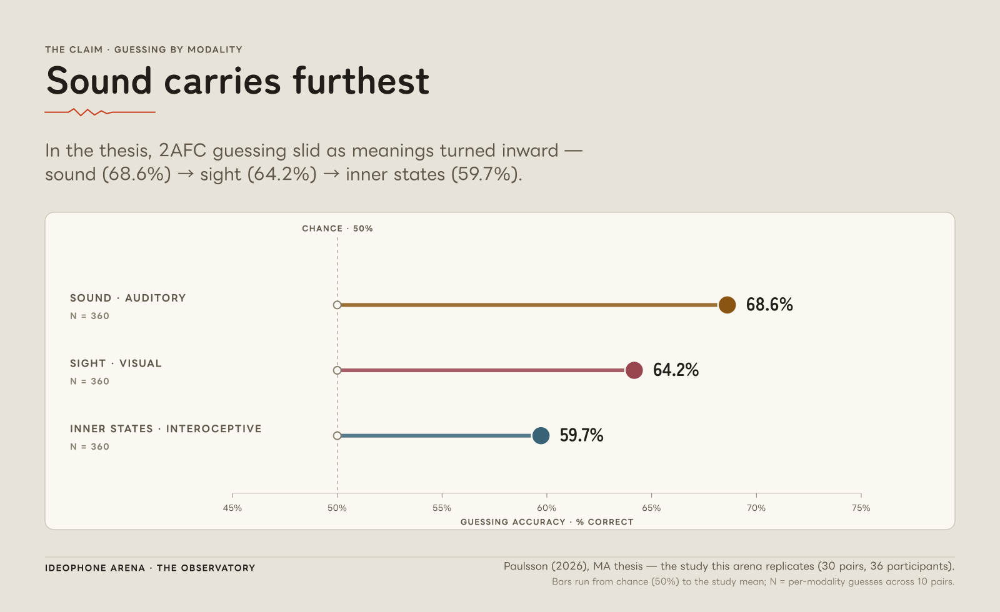
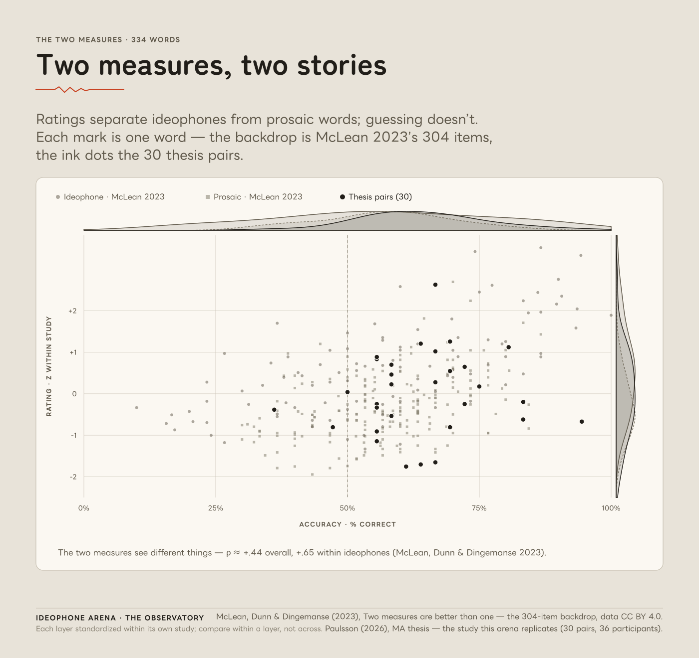
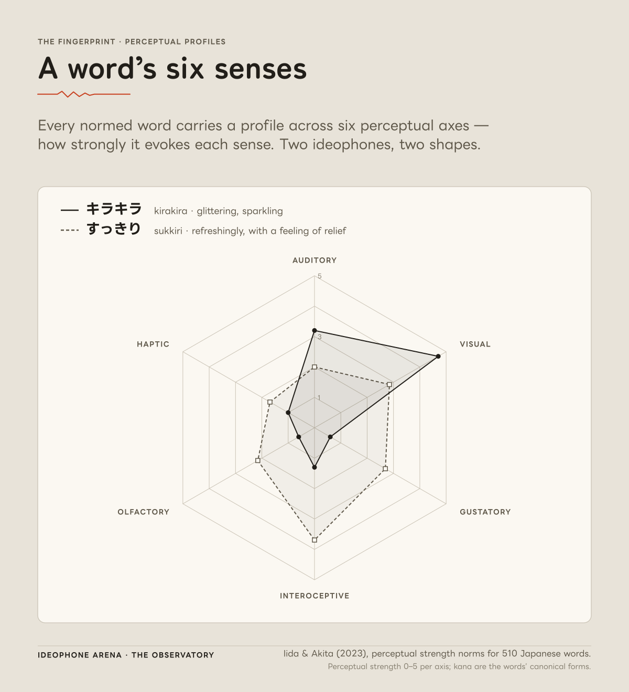

# Ideophone Arena — API

> Ideophone Arena is not "guess the Japanese word." It is *"explore how far iconicity carries
> you before convention takes over."*

The Spring Boot backend for **Ideophone Arena**: a gamified two-alternative forced-choice (2AFC)
experiment grown out of an MA thesis on Japanese ideophones and script iconicity. Players hear two
real, contrastive ideophones and pick which one matches an English meaning — under one of three
script-presentation conditions. The backend runs the game, stores every answer and rating, and
exposes a public **Observatory**: a read-only research surface computed over both the live crowd and
the thesis's own 36 participants.

It began as a graded course project. It is becoming a portfolio piece and a live research
instrument, and correctness of the experimental manipulation outranks every feature.

<!-- NIL-84 (essence review): the "instrument / research surface" framing and the conceptual-spine
     epigraph above are interpretive; the morning essence pass may revise the wording. Revise, do not rewrite. -->

**At a glance** — Spring Boot 4.0.6 · Java 21 · MySQL · hand-rolled JWT · port `8081` ·
`./mvnw test` → 97 tests green.
Live modes: **Meaning Match**, **Rating Lab**, the **Observatory**. On the roadmap: Perception
Ladder, Word Mint, Word Anatomy, cross-linguistic. Not yet deployed — a self-hosted W30 target
(see [Current state & roadmap](#current-state--roadmap)).

---

## The research story

<!-- NIL-84 (essence review): claims in this section are the thesis's; numbers trace to
     docs/research/thesis-facts.md. Framing/emphasis may be revised in the essence pass. -->

Ideophones are words whose *sound* resembles their *meaning* — Japanese has thousands of them
(きらきら *kirakira* "glittering", どきどき *dokidoki* "a racing heartbeat"). The thesis
([Paulsson 2025](#research--citations)) asked a simple question with a careful design: can people who
have never studied Japanese guess what these words mean, better than chance, from sound alone — and
does *seeing the kana* help or hurt?

**36 participants** completed two tasks on the Gorilla platform: a 30-trial **Choosing Task** (guess
which of two ideophones matches a target meaning — the pre-reflective measure) and a **Rating Task**
("How much does this word sound like what it means?", 1–7 — the reflective measure). Stimuli were 30
contrastive pairs (60 words), 10 in each of three sensory modalities (auditory, visual,
interoceptive). Between subjects, one of three conditions: audio-only, congruent script, incongruent
script. Audio was Google Cloud TTS (`ja-JP-Wavenet-B`), identical across conditions.

**The claim: iconicity is real, and it is ordered.** People guessed correctly **≈64%** of the time
(19.25 / 30) against a 50% chance baseline — and accuracy fell in a clean line down the sensory
hierarchy: sound words easiest, inner-state words hardest.

<p align="center">
  
  <br>
  <em>The claim — accuracy by modality. Thesis means <strong>68.6 → 64.2 → 59.7%</strong>
  (auditory → visual → interoceptive; 6.86 / 6.42 / 5.97 out of 10), chance hairline at 50%.
  Source: Paulsson (2025), the MA thesis this arena replicates (30 pairs, 36 participants).</em>
</p>

**The twist: script changed the *feeling*, not the score.** Seeing the kana had a negligible
group-level effect on guessing accuracy (condition means 63.6 / 63.6 / 65.3% — if anything the
mismatched-script group did trivially better). But it *dampened felt iconicity*: audio-only
participants rated words higher (M ≈ 4.50) than either script group (M ≈ 4.15). This is why the app
frames the manipulation as **"presentation changes the experience," never "matched script helps."**

---

## From thesis to instrument

The app turns a fixed 30-trial experiment into a replayable game while keeping the manipulation
scientifically intact. The design spine is a slate of **modes**, each one either a *measure* of
iconicity or a *journey* through it. Player-facing names are the adopted slate
([`docs/specs/UI-SYSTEM.md` §10.2](docs/specs/UI-SYSTEM.md)); the internal / thesis vocabulary is
kept for the record.

<!-- NIL-84 (essence review): mode lineup and the LIVE/ROADMAP split below are current-state facts,
     but the one-line mode framings and the cross-linguistic naming may be tuned in the essence pass. -->

| Mode (player-facing) | Internal / thesis term | Measure | Status |
|---|---|---|---|
| **Meaning Match** (incl. Script Lab conditions) | Choosing Task / 2AFC | guessing | **Live** |
| **Rating Lab** | Rating Task | rating | **Live** |
| **Perception Ladder** | Modality Ladder (Sound → Sight → Inner States → Touch) | journey | Roadmap (W28) |
| **Word Mint** | free-form entry / production | production | Roadmap (next greenfield build) |
| **Word Anatomy** | phoneme-shape / template reading | structure | Specced, deferred |
| **Polyglot Challenge** | cross-linguistic (5 languages) | transfer | Specced, deferred |

*Script Lab is not a separate mode* — it is the condition selector inside Meaning Match (audio-only /
congruent / incongruent), the thesis's own between-subjects manipulation offered as a within-player
choice.

Three things make the instrument honest under replay:

- **Script display is data, not code.** What kana a player sees comes from the seeded
  `presentations.display_form` string, rendered verbatim — never derived, transliterated, or detected
  at runtime. The audio channel is one shared file per word and is identical across all three
  conditions.
- **A deterministic per-session shuffle.** Each session stores a server-generated `shuffle_seed`
  (`SecureRandom`, never exposed). From the seed alone the backend re-derives round order, which word
  of each pair is the target, its left/right side, and meaning-line order — recomputed from scratch on
  every request, so a session replays identically across restarts. Target *identity* randomization is
  a deliberate extension beyond the thesis (which fixed targets by pairing parity), doubling the
  effective item pool.
- **The canonical pairings never move.** Pairs contrast in both meaning and script dominance within a
  single modality, exactly as the thesis built them.

---

## Two measures

<!-- NIL-84 (essence review): the divergence interpretation is the load-bearing framing claim of the
     whole project. Keep "the two measures see different things" / "ratings detect ideophone-ness;
     guessing doesn't"; never "orthogonal", never "unrelated". Essence pass may sharpen the prose. -->

The thesis's most game-worthy finding is that *guessing* and *rating* are not the same thing. The
word people **felt** was most iconic — どきどき *dokidoki*, a racing heartbeat, rated ~5.8 of 7,
the highest of all — was one they guessed only modestly well (~67%). The hardest word to guess,
しょぼん *shobon* "downhearted", got only **36%** right, worse than a coin flip, yet rated
middling. Across modalities the two rankings invert: interoceptive words rate most iconic (4.45) but
guess worst; auditory words guess best but rate least iconic (4.08).

The two measures are positively but only partially correlated. They **see different things**:
*ratings detect ideophone-ness; guessing doesn't.* **Rating Lab** captures the reflective measure in
the app — after a round reveals a word's meaning, that word becomes ratable on the same 1–7 scale,
one rating per word per user.

<p align="center">
  
  <br>
  <em>The two measures — guessing (x) vs rating (y), one mark per word. Backdrop: McLean, Dunn &amp;
  Dingemanse (2023), "Two measures are better than one" — the 304-item backdrop, data CC BY 4.0.
  Ink dots: the 30 thesis pairs. Vermillion: this arena's own record, growing with play.</em>
</p>

---

## The research surface: the Observatory

<!-- NIL-84 (essence review): "research surface / Observatory" framing is interpretive; wording may be revised. -->

The thesis's full dataset — 36 participants, 1,080 choosing answers, 1,080 ratings — is ingested as
generator-emitted seed (reserved `thesis_p%` usernames, sessions left `completed_at = NULL` so they
can never touch the leaderboard). A family of public, read-only endpoints under `/api/research/**`
aggregate this record; the frontend's **Observatory** renders them as a public research page. The
live crowd layer and the thesis-cohort layer are computed separately, so the public view stays
byte-stable as new players arrive.

The thesis layer reproduces the study's headline figures exactly — its per-modality accuracies and
the overall **693 / 1,080** correct — because it *is* the thesis's own data flowing through the same
code the live game uses.

<p align="center">
  
  <br>
  <em>The fingerprint — per-word modality profiles across six perceptual-strength axes (0–5),
  default compare キラキラ kirakira vs すっきり sukkiri.
  Source: Iida &amp; Akita (2023), perceptual strength norms for 510 Japanese words.</em>
</p>

**Observatory endpoints** (public, no auth):

| Endpoint | What it returns |
|---|---|
| `GET /api/research/divergence` | Per word: live-crowd guess accuracy vs mean rating (one row per word with any data) |
| `GET /api/research/thesis/divergence` | Same shape over the thesis cohort only — reproduces the thesis's per-modality accuracies |
| `GET /api/research/rating-distributions` | Per-modality 1–7 rating histogram (dense grid + per-modality n) |
| `GET /api/research/position-bias` | Signal-detection fairness check on the forced choice, replayed from the shuffle |

---

## Architecture

A conventional, strictly layered Spring Boot service — and a data model that was recently normalized
to make the experiment's units first-class.

**The story of the schema.** The original schema keyed everything on one row per *word × script
condition*, which quietly let the same word be rated twice across conditions and gave the pair — the
thesis's actual unit of difficulty — no home. The **M2 re-key** (shipped) split `ideophones` into
`words` + `presentations`, collapsed the three per-condition round copies into one condition-free
`trials` table, and gave pairs a `pairings` table and languages a `languages` table. Every public
response shape was frozen and verified byte-for-byte across the change; the deterministic shuffle is
byte-identical (its id vocabulary just re-binds to word ids). The result is three deliberately
distinct planes:

- **Content plane** (seed-owned, regenerable): `languages`, `words`, `presentations`, `pairings`,
  `trials`. Emitted by `scripts/generate_seed_sql.py`; `--check` is the integrity layer.
- **Event plane** (player-owned, append-only): `player_answers`, `ratings` — re-keyed to word grain
  with `UNIQUE(user_id, word_id)`, so "one rating per word per user" is enforced by the database, not
  by convention.
- **Account plane**: `app_users`, `game_sessions`.

**Hard layering rules** (graded, non-negotiable):

- Controllers are thin: `ResponseEntity`, DTOs only, `@Valid` on request bodies, no business logic,
  never touch repositories.
- Services own the logic and `@Transactional`; they never return entities and know no HTTP.
- All entity ↔ DTO mapping lives in dedicated mappers.
- Repositories use derived queries or JPQL with bound params only.
- Custom exceptions + a `GlobalExceptionHandler`; `DataIntegrityViolationException` → `409`; stack
  traces never leak.
- Constructor injection; no Lombok; no new dependencies without approval.

**Security.** JWT is *deliberately hand-rolled* in `JwtService` (HMAC-SHA256, constant-time compare)
and covered by unit tests — a conscious "understand it, don't import it" choice. The signing secret
comes from properties with **no code default** (the app fails fast if it is absent). BCrypt for
passwords; roles `ROLE_USER` / `ROLE_ADMIN`; CORS is explicit for the Vite origins; CSRF is disabled
only because auth is stateless.

**Repo map:**

```
src/main/java/io/github/nilsfjp/ideophonearena/
  controller/   Auth · Game · Rating · Score · Admin · Research · Health
  service/      GameService · RatingService · ScoreService · AdminStatsService
                ResearchService · RoundShuffler · PositionBiasCalculator · AuthService
  repository/   Spring Data JPA + JPQL projections (leaderboard, stats, divergence, ...)
  mapper/       GameMapper · RatingMapper · AdminStatsMapper · ResearchMapper
  model/        Language · Word · Presentation · Pairing · Trial · GameSession
                PlayerAnswer · Rating · AppUser (+ enums, DerivedRound)
  security/     JwtService (hand-rolled) · JwtAuthenticationFilter · ArenaUserDetailsService
  config/       SecurityConfig · OpenApiConfig · StimulusResourceConfig
  dto/  exception/
src/main/resources/db/init/ideophone_arena.sql   schema + seed (ddl-auto=validate, always)
scripts/generate_seed_sql.py                     the single source of the seed (--check)
docs/                                            contract, guidelines, runbook, research, specs
```

**Experiment invariants — do not modify without explicit approval.** Three script conditions
(`CONDITION_1/2/3_SOKUON`), `difficultyLevel` locked to `1`; `display_form` is the single source of
truth for displayed kana; pairings are canonical per the thesis; audio is identical across
conditions. Full text in [`AGENTS.md`](AGENTS.md) and [`docs/backend-contract.md`](docs/backend-contract.md).

---

## Run it

<!-- NIL-45: embed the demo GIF here (docs/images/demo-loop.gif) once recorded. -->

The reviewer path is **one command** — a seeded MySQL plus the API jar — so you can hit a running
backend with no local Java/MySQL setup. The companion Vite frontend
([`ideophone-arena-web`](https://github.com/nilsfjp/ideophone-arena-web)) runs separately; Docker
here is **backend + MySQL only**, by design.

```sh
cp .env.example .env          # set APP_JWT_SECRET (required, no default), MYSQL_ROOT_PASSWORD, STIMULI_HOST_DIR
docker compose up -d --build
curl -i http://localhost:18081/api/health   # note: 18081, so it never collides with a dev backend on 8081
docker compose down -v        # tear down; -v drops the MySQL volume so the next start reseeds
```

**Local dev** (Java 21 + a local MySQL `ideophone_arena` database):

```sh
./mvnw spring-boot:run                         # http://localhost:8081
curl -i http://localhost:8081/api/health
```

Local secrets and DB credentials live in the git-ignored
`src/main/resources/application-local.properties` — copy the tracked
`application-local.example.properties` template. `spring.jpa.hibernate.ddl-auto=validate` in every
profile; the schema is owned by the init SQL, never by Hibernate.

**Test:**

```sh
./mvnw test        # 97 tests: Spring context, security wiring, the authenticated game flow (MockMvc),
                   # hand-rolled JWT, seed integrity, admin authz, leaderboard, ratings, and the Observatory
```

**A minimal game flow** (see [`docs/demo-runbook.md`](docs/demo-runbook.md) for the full script):

```sh
# register + login, then export TOKEN from the login response
curl -s -X POST http://localhost:8081/api/game/sessions \
  -H "Authorization: Bearer $TOKEN" -H 'Content-Type: application/json' \
  -d '{"conditionName":"CONDITION_2_SOKUON","difficultyLevel":1}'

curl -s http://localhost:8081/api/game/sessions/$SESSION_UUID/rounds/next \
  -H "Authorization: Bearer $TOKEN"

curl -s -X POST http://localhost:8081/api/game/sessions/$SESSION_UUID/answers \
  -H "Authorization: Bearer $TOKEN" -H 'Content-Type: application/json' \
  -d '{"roundId":1,"selectedIdeophoneId":1,"responseTimeMs":1200}'
```

Interactive API docs (public for the demo): `http://localhost:8081/swagger-ui/index.html`.

---

## API surface

| Area | Endpoints |
|---|---|
| **Auth** (public) | `POST /api/auth/register` · `POST /api/auth/login` |
| **Game** (auth) | `POST /api/game/sessions` · `GET /api/game/sessions/{uuid}/rounds/next` · `POST /api/game/sessions/{uuid}/answers` · `GET /api/game/me/attempts` |
| **Rating Lab** (auth) | `POST /api/ratings` · `GET /api/game/me/ratings` · `GET /api/game/me/ratable-words` |
| **Leaderboard** (public) | `GET /api/leaderboard` — best *completed* session, paginated |
| **Observatory** (public) | `GET /api/research/divergence` · `/thesis/divergence` · `/rating-distributions` · `/position-bias` |
| **Admin** (`ROLE_ADMIN`) | `GET /api/admin/stats` |
| **Infra** (public) | `GET /api/health` · `GET /stimuli/**` · `GET /v3/api-docs` · `GET /swagger-ui/index.html` |

`docs/backend-contract.md` is the authority for request/response shapes and error codes.

---

## Current state & roadmap

**Live now:** Meaning Match (2AFC guessing + Script Lab conditions + optional practice rounds),
Rating Lab, the Observatory (four public research endpoints + the thesis layer), the deterministic
per-session shuffle, admin stats, a paginated best-completed-session leaderboard, and the
word-grain schema (M2). 97 tests green.

**On the roadmap:** Perception Ladder (W28), Word Mint (the production measure — the next greenfield
build, completing the choosing / rating / production triad), Word Anatomy (phoneme-shape templates),
and the cross-linguistic mode (5 languages). Their tables (`productions`, `word_features`,
`stimulus_sources`) are designed in [`docs/specs/ARCHITECTURE.md`](docs/specs/ARCHITECTURE.md) but
not yet built.

**Deployment:** designed and costed, **not yet live**. The intended shape is the existing
`docker compose` stack on a single self-hosted box (Hetzner CX32) behind Caddy for automatic HTTPS,
with the built frontend served same-origin — no separate web container, EU/GDPR. A W30 target,
gated on Nils's host ratification and on closing the participant-data privacy gate (the api half of
which — untracking the `gorilla-tidy-*.csv` participant rows — is done; aggregates stay).

<!-- NIL-84 (essence review): the deploy paragraph describes a Proposed plan (SPEC-hosting ADR-H1),
     not a live deploy. Keep it in the conditional; do not claim a running public instance. -->

---

## Research & citations

Numbers in this README trace to [`docs/research/thesis-facts.md`](docs/research/thesis-facts.md);
figure captions carry their sources' own attribution. Data reused under CC BY is credited; the app
is a non-commercial research/portfolio project.

- **Paulsson, N. (2025).** *Unimodal and Cross-Modal Iconicity in Japanese Ideophones: A
  Cognitive-Semiotic Approach.* MA thesis, Cognitive Semiotics, Lund University — the thesis this
  arena replicates (30 pairs, 36 participants).
- **McLean, B., Dunn, M., & Dingemanse, M. (2023).** *Two measures are better than one.* Language and
  Cognition. — the 304-item backdrop; data CC BY 4.0.
- **Iida & Akita (2023).** Perceptual strength norms for 510 Japanese words. — the radar's axes.
- **Dingemanse (2012)** · **McLean (2021)**, *Linguistic Typology* — the implicational hierarchy
  (SOUND < MOVEMENT < FORM < TEXTURE < OTHER) the modality ordering follows.

---

*Backend authority docs: [`AGENTS.md`](AGENTS.md) ·
[`docs/backend-contract.md`](docs/backend-contract.md) ·
[`docs/project_guidelines.md`](docs/project_guidelines.md) ·
[`docs/demo-runbook.md`](docs/demo-runbook.md).*
